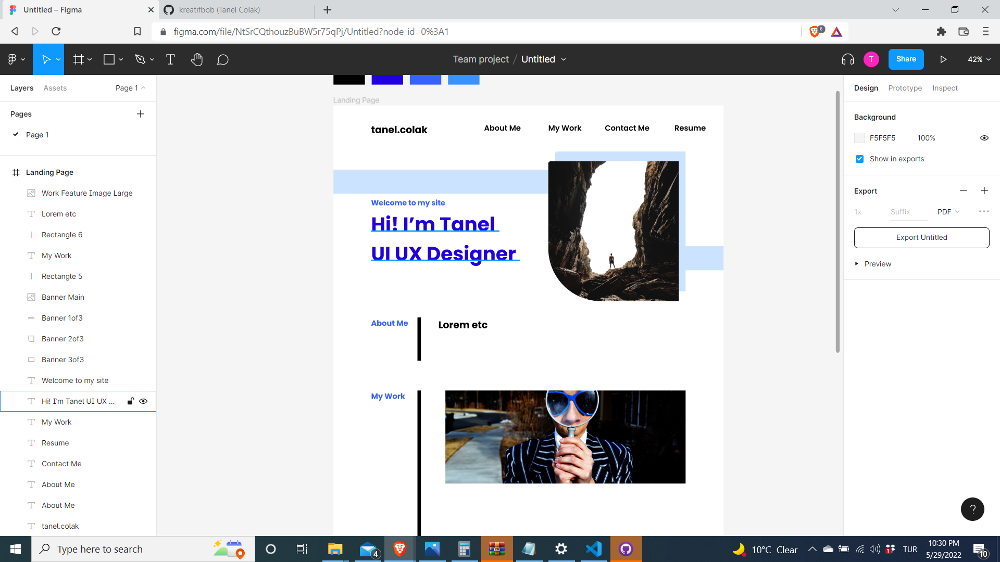

# Scratch-Portolio
 When Coding Bootcamp Challenges Me Part2

 # Table of Contents 
 1. Introduction
 2. Site Url
 3. Key Topics 
 4. Screenshot(s)

 # 1. Introduction
 This readme is to showcase desired portfolio page whilst attempting in meeting Week 2 Challenge acceptance criteria.
 
 # 2. Site URL 
 https://kreatifbob.github.io/Scratch-Portfolio/

 # 3. Key Topics 
Key topics covered are as follows;

HTML 
HTML Comments and Markups 
Header Navigation and ID Links 
Semantic elements, tags, attributes
CSS
Flexboxes
Aside Tag - (Missing)
Positioning and floats 

 # 4. Screenshot 
 See screeshot below to desired deployed URL
 
 See screenshot below to currently deployed URL
 

 
